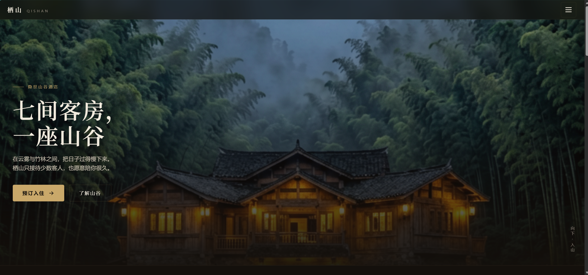
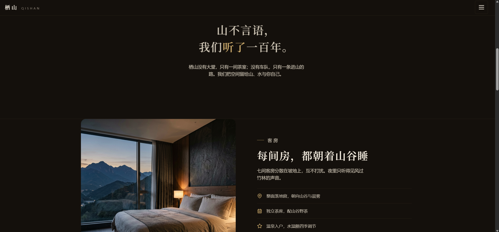
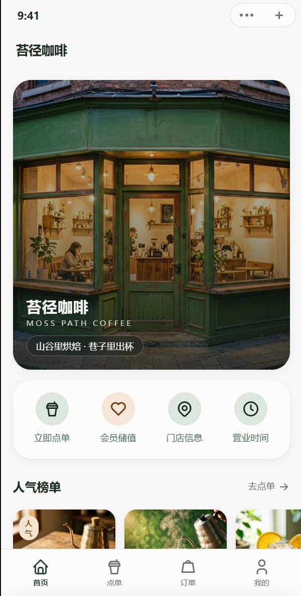
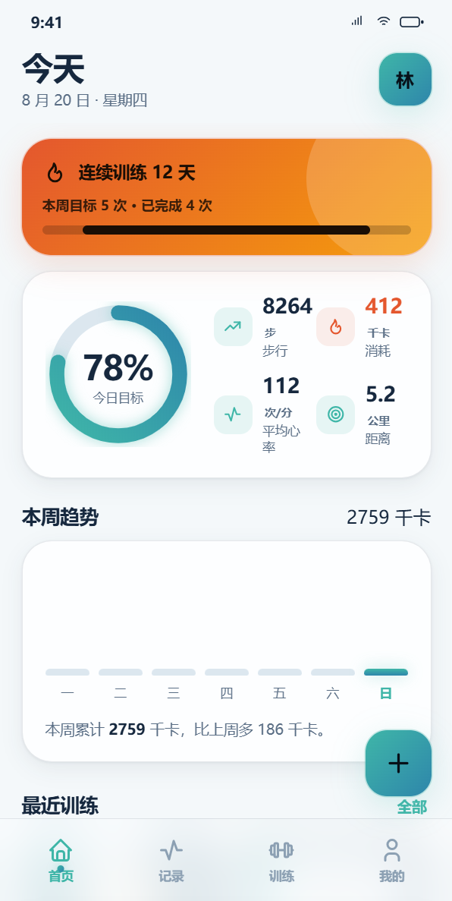
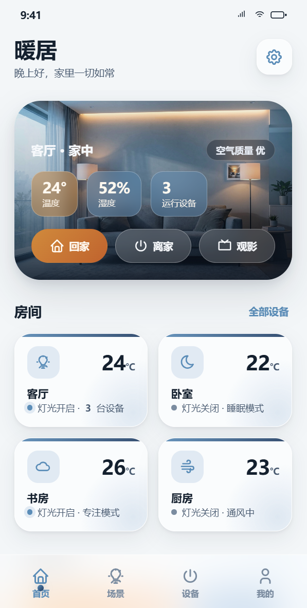
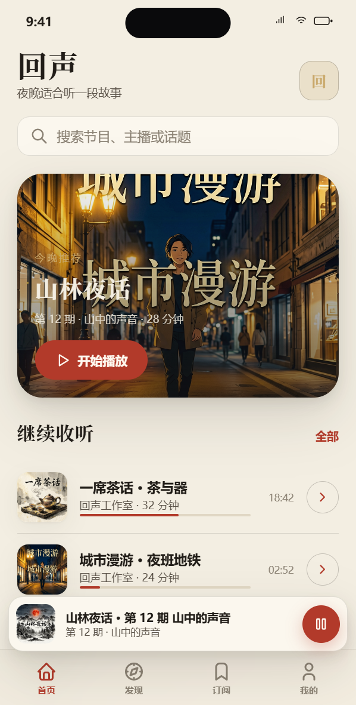
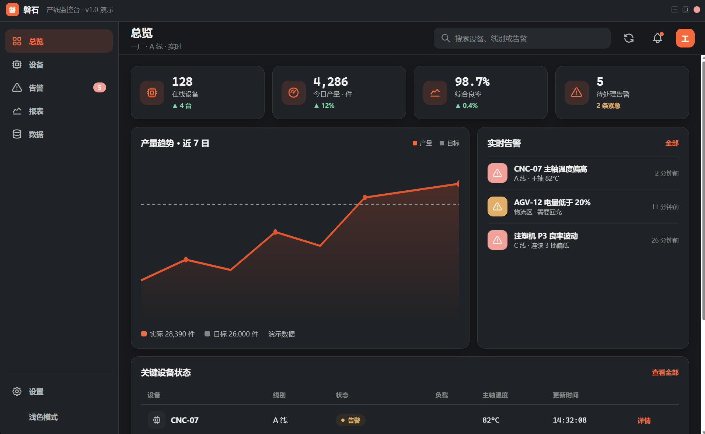
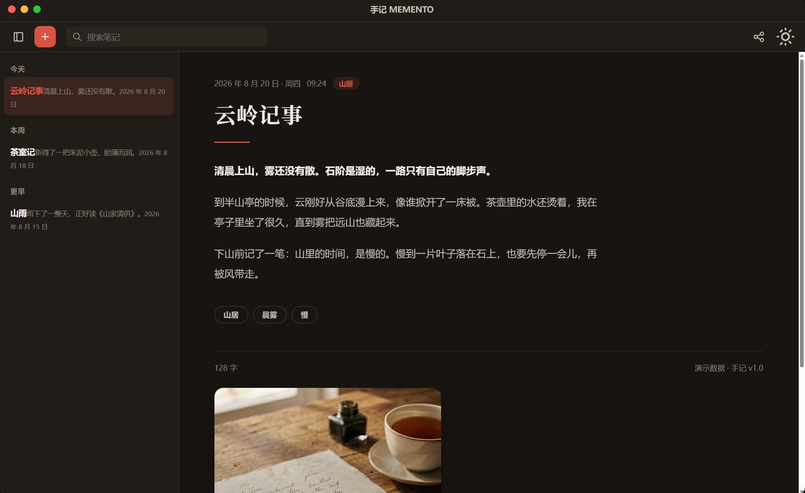

# UI Alchemy · 界面炼金术

> 把品味、工艺、UX 智能与 3D 动效，炼成不撞款的高级前端。
> 一个 SKILL.md，在 Codex / Claude Code / Cursor / Windsurf / Gemini CLI / Copilot / OpenCode / Trae / Grok 全部智能体里表现一致。


---

## 为什么你需要它

AI 生成的界面有一张"默认脸"：暖米色底 + 衬线标题 + 陶土强调；或者近黑底 + 一个荧光绿；或者三等宽卡片排满、Inter 字体、紫粉渐变、破折号刷屏。

**UI Alchemy 是一套可执行的工艺系统**：先读懂需求，再定方向，按 Apple 级规格构建，最后用确定性扫描器过预检。它不给你"设计建议"，给你**能直接照抄的数字、模板与反模式**。

---

## 它融合了什么

系统性蒸馏当下最火的设计类 Skill 与成熟体系（详见下方来源表）：Anthropic 官方 frontend-design 与 theme-factory、OpenDesign 151 套生产设计体系反解、taste-skill 反 AI 味纪律、emil-kowalski 动画哲学、video-shotcraft 产品视频流水线、Meshy / Rodin 3D 生成、ui-design-brain 组件知识库、Ilm-Alan 八美学锚点，以及 Apple HIG / Material 3 等平台规范。

---

## 核心特性

- **先问清楚再动手（意图门）**：产品/受众/平台/目标/风格/素材缺一不可，一轮最多 3 问，不跳过门禁。
- **Apple 级布局规格**：8pt 网格、字号阶梯精确表、四种 Section 节奏模板、留白公式，布局用数字说话。
- **八美学锚点**：Swiss / Industrial / Brutalist / Aurora / Chaotic / Retro-Futuristic / Editorial / Dark Luxury，每个锚点锁定精确 CSS tokens 与 "breaks if" 纪律。
- **十套高级风格配方 + 12 组验证调色板**：`palette.py` 一键把品牌色展开为 50-950 色阶与明暗语义 token，自动过 WCAG 对比度。
- **大厂体系库**：Apple / Stripe / Linear / Vercel / WeChat / 小红书 / Material 的反解 token、字体、布局签名与"最适合/最不适合"。
- **滚动 3D 电影规格**：340vh + sticky 结构、zoom/pan/饱和度参数表、禁 scroll 监听的参考实现、四幕文案模板，照抄即出 Apple 级滚动叙事。
- **真实资产优先铁律**：真实 HDRI（Poly Haven）、真实 PBR 贴图（ambientCG）、生图模型生成标签（消灭 AI 乱码）、禁止程序几何体玩具。
- **组件布局模式**：60+ 组件的最佳实践（导航/卡片/表单/弹层/空态），写组件前必查。
- **平台最佳范式**：小程序（750rpx/setData/安全区）、H5（viewport/Core Web Vitals）、App（iOS HIG / Material 3 / Compose / ArkUI）各有一套方案。
- **确定性预检扫描器**：零依赖 `preflight_check.py`，自动抓破折号、纯黑纯白、`transition: all`、scroll 监听、缺 alt、白底白字 CTA。
- **五维终审评分制**：布局节奏 / 排版层级 / 色彩纪律 / 动效品质 / 无障碍，任一维 < 7 分返工。
- **图片人智能体**：开源 SVG 下载 + 生图模型（推荐 text-model-multimodal-skill，Agnes 免费 API）生成照片/插画/3D 渲染图。

---

## 真实效果

用这套 Skill 产出、已在真实项目中验证的界面：

<div align="center">
  <table>
    <tr>
      <td align="center"><b>网页 · 栖山 QISHAN</b><br><span style="color:#888">东方美学度假酒店官网</span></td>
      <td align="center"><b>小程序 · 苔径咖啡</b><br><span style="color:#888">咖啡门店会员首页</span></td>
    </tr>
    <tr>
      <td>
        <br>
        
      </td>
      <td></td>
    </tr>
    <tr>
      <td align="center"><b>安卓 · 运动健康</b><br><span style="color:#888">健康数据与训练记录 APP</span></td>
      <td align="center"><b>鸿蒙 · 暖居</b><br><span style="color:#888">智能家居控制中心</span></td>
    </tr>
    <tr>
      <td></td>
      <td></td>
    </tr>
    <tr>
      <td colspan="2" align="center"><b>iOS · 回声</b><br><span style="color:#888">播客应用：暖米色调 + 城市插画 + 四宫格导航</span></td>
    </tr>
    <tr>
      <td colspan="2" align="center"></td>
    </tr>
    <tr>
      <td align="center"><b>Windows · 磐石</b><br><span style="color:#888">产线监控台</span></td>
      <td align="center"><b>macOS · 手记 MEMENTO</b><br><span style="color:#888">散文笔记应用</span></td>
    </tr>
    <tr>
      <td></td>
      <td></td>
    </tr>
  </table>
</div>

七端齐活，同一套设计语言在不同平台的原生落地：网页（栖山）首屏竹林 + 木屋暖光、"向下·入山"竖排引导，下半页深棕黑底米白衬线的客房卖点；小程序（苔径咖啡）绿色 + 米白、门店实景、快捷入口与人气榜单；安卓（运动健康）卡片式数据面板与底部导航；鸿蒙（暖居）ArkUI 卡片化智能家居控制；iOS（回声）暖米色调播客应用 + 四宫格导航；Windows（磐石）深色产线监控台；macOS（手记）侧栏 + 文章阅读的笔记应用。

---

## 安装（无需联网，复制即用）

把整个 `ui-alchemy/` 目录复制到你的智能体对应位置：

| 智能体 | 位置 |
|---|---|
| Codex / 通用 | `~/.agents/skills/ui-alchemy/` 或项目 `.agents/skills/ui-alchemy/` |
| Claude Code | `~/.claude/skills/ui-alchemy/` |
| Cursor | `.cursor/skills/ui-alchemy/`（需开启 Agent Skills） |
| Gemini CLI | `~/.gemini/skills/ui-alchemy/` |
| GitHub Copilot | `.github/skills/ui-alchemy/` |
| Trae / 其他 | 对应工具的 skills 目录 |

重启智能体后生效。

---

## 快速开始

```text
用 ui-alchemy 给这个 SaaS 做一个不像模板的落地页
use ui-alchemy to redesign this dashboard, preserve the brand
use ui-alchemy audit on the checkout flow
use ui-alchemy showcase3d 给产品做一个滚动 3D 电影
```

内置命令：`shape`（规划）· `init`（沉淀产品上下文）· `critique` / `audit` / `polish`（评审三件套）· `bolder` / `quieter`（增强/收敛）· `distill`（极简）· `harden`（生产加固）· `animate` / `showcase3d`（动效与 3D）· `colorize` / `typeset` / `layout`（三元素专项）· `delight` / `overdrive` · `clarify`（文案）· `adapt`（多端适配）· `optimize`（性能）。

---

## 文档地图

`SKILL.md` 是唯一入口，按阶段路由到 20 个参考文档：

| 阶段 | 文档 |
|---|---|
| 意图 | `intent-brief.md` |
| 方向 | `design-language.md` · `aesthetic-anchors.md` · `premium-aesthetics.md` · `palette-system.md` · `mature-systems-library.md` |
| 布局 | `layout-system.md` · `component-patterns.md` · `interface-craft.md` |
| 构建 | `craft-floor.md` · `ux-intelligence.md` · `ios-hig.md` · `enterprise-systems.md` · 平台文档 ×3 |
| 3D 动效 | `motion-3d.md` · `scroll-film-spec.md` · `product-3d-showcase.md` |
| 图片 | `image-assets.md` |
| 终审 | `final-review.md` · `preflight.md` · `redesign-audit.md` |

脚本：`palette.py`（色阶生成 + 对比度自检）· `palette_card.py`（色卡可视化）· `fetch_svg.py`（开源图标下载）· `preflight_check.py`（确定性预检）。

---

## 来源（Fused From）

| 来源 | 贡献 | 许可 |
|---|---|---|
| [anthropics/skills · frontend-design](https://github.com/anthropics/skills/tree/main/skills/frontend-design) | 差异化设计哲学、文案纪律 | MIT |
| [anthropics/skills · theme-factory](https://github.com/anthropics/skills/tree/main/skills/theme-factory) | 10 套快速主题配方 | MIT |
| [nexu-io/open-design](https://github.com/nexu-io/open-design) | 151 套生产设计体系反解 | AGPL-3.0（仅吸收方法与 token 事实） |
| [Leonxlnx/taste-skill](https://github.com/Leonxlnx/taste-skill) | 反 AI 味纪律、三旋钮、设计系统地图 | MIT |
| [nextlevelbuilder/ui-ux-pro-max-skill](https://github.com/nextlevelbuilder/ui-ux-pro-max-skill) | UX 优先级规则库、可访问性 | MIT |
| [Dammyjay93/interface-design](https://github.com/Dammyjay93/interface-design) | 工艺优先的界面设计、token 架构 | MIT |
| [pbakaus/impeccable](https://github.com/pbakaus/impeccable) | 质量底线、命令词汇 | Apache-2.0 |
| [emilkowalski/skills](https://github.com/emilkowalski/skills) | 动画决策框架、缓动曲线 | MIT |
| [Vincentwei1021/video-shotcraft](https://github.com/Vincentwei1021/video-shotcraft) | 产品视频八阶段流水线、判例审美 | MIT |
| [meshy-dev/meshy-3d-agent](https://github.com/meshy-dev/meshy-3d-agent) · [DeemosTech/rodin3d-skills](https://github.com/DeemosTech/rodin3d-skills) | 3D 模型生成 API 工作流 | MIT / Apache-2.0 |
| [kevinbadi/blender-skills](https://github.com/kevinbadi/blender-skills) | Blender 3D 产品精修 | MIT |
| [Ilm-Alan/frontend-design](https://github.com/Ilm-Alan/frontend-design) | 八美学锚点 → token 映射 | MIT |
| [carmahhawwari/ui-design-brain](https://github.com/carmahhawwari/ui-design-brain) | 60+ 组件布局模式 | MIT |
| [Wholiver/swiftui-design-skill](https://github.com/Wholiver/swiftui-design-skill) | 六铁律、五维审查 | MIT |
| [OneRedOak/claude-code-workflows · design-review](https://github.com/OneRedOak/claude-code-workflows/tree/main/design-review) | Live Environment First 评审法 | MIT |
| [jiji262/claude-design-skill](https://github.com/jiji262/claude-design-skill) · [ZeroZ-lab/cc-design](https://github.com/ZeroZ-lab/cc-design) · [vercel-labs/agent-skills](https://github.com/vercel-labs/agent-skills) | 设计语言锚点、slop 速查、Web 指南 | MIT |
| [yan-stone-computer/text-model-multimodal-skill](https://github.com/yan-stone-computer/text-model-multimodal-skill) | 生图/视频/识图（Agnes 免费 API） | 见仓库 |
| Apple HIG / Material 3 / WeUI | iOS 导航硬要求、组件一致性 | 引用规范 |

---

## 许可证

MIT。参考文档中引用的体系 token 与事实来自各上游（见来源表），实现均为原创。
